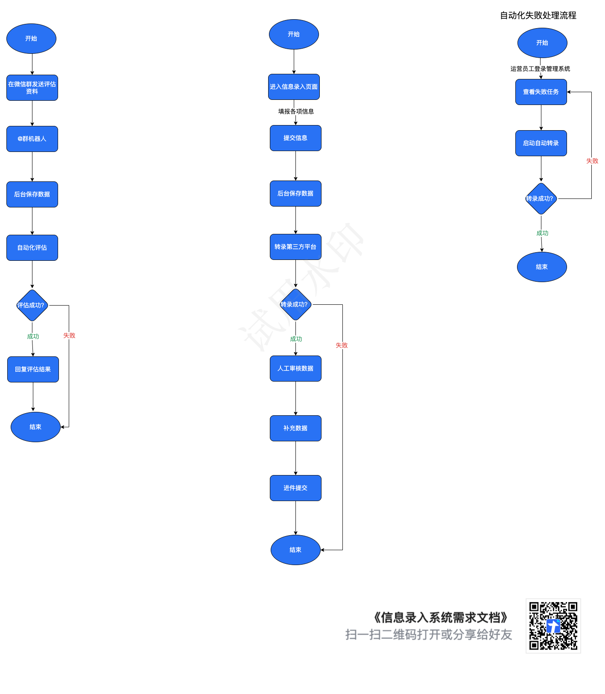
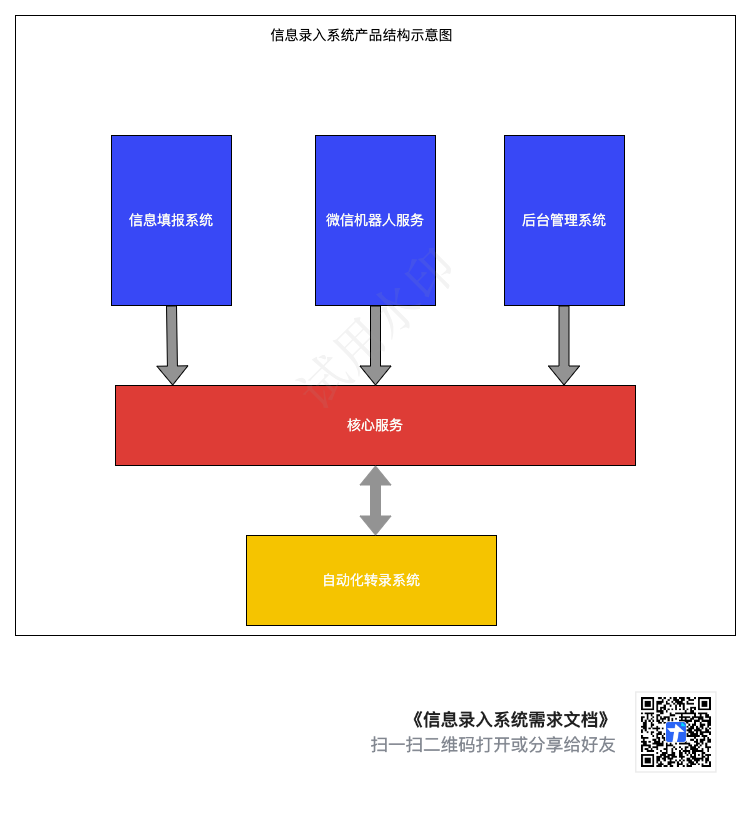
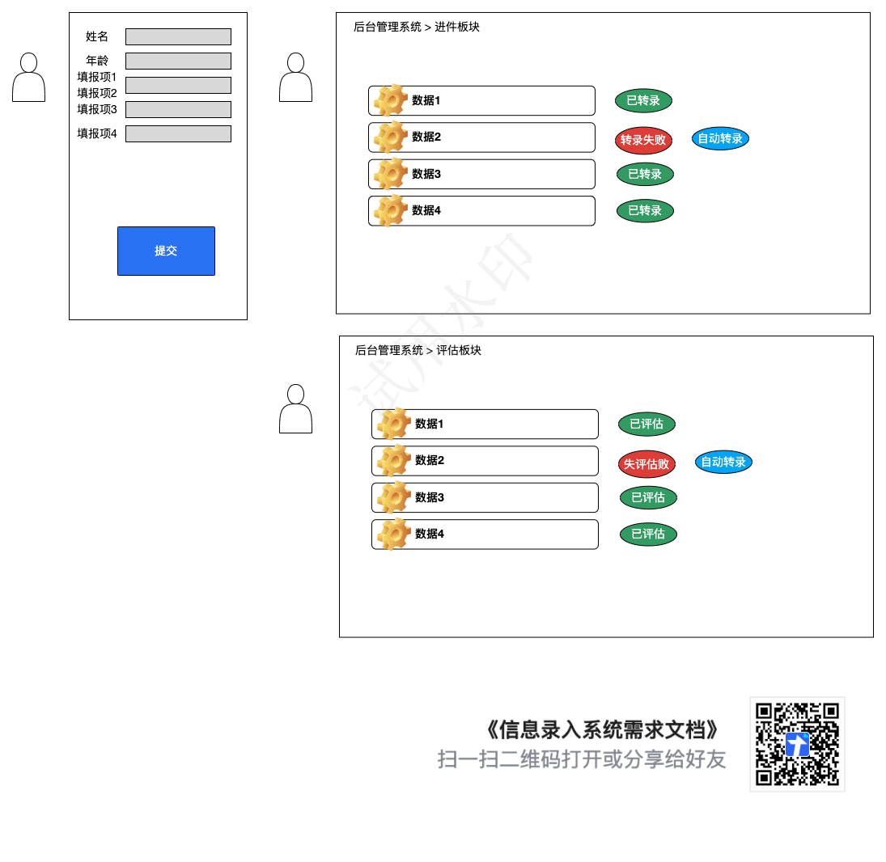

# 需求分析文档

| 编写人  | 郭浩         | 路统                                                                     |
| ---- | ---------- | ---------------------------------------------------------------------- |
| 版本   | 1.0        | 出版                                                                     |
| 编写时间 | 2.0        | 
1.  完善工作流程图

2.  完善架构设计

3.  新增产品原型图

4.  完善需求分析
 |
|      | 2024-05-10 |                                                                        |

## 一、项目背景

信息录入工作繁重，机械。信息来源多样，存在的形式多样，不统一，导致信息管理困难，需要投入大量人力物力。并且信息转录金融服务平台不够及时，导致工作效率低下。

## 二、  项目目标

1\.  解决信息来源复杂，解决消息源头多样的情况

2\.  提供便捷简单的信息录入门户，以方便客户/运营人员录入信息

3\.  建立统一的后台管理系统提高运营人员的信息审核效率

4\.  建立自动化信息转录系统，提高信息转录的效率，节省人力成本

## 三、核心场景

### 1、  客户分析

用户/业务员在群里按照一定的规则和顺序发送行驶证照片以及必要的信息并@机器人助理，可以通过自动化系统对接第三方服务器平台直接完成评估填报的流程，并且及时的得到评估价格。

用户/业务员通过扫码进入进件填报门户，允许用户通过手机填报各项信息。完成信息的第一次录入。信息录入后由自动化系统转录到第三方金融平台，并在我方后台系统留存记录。

### 2、  运营人员分析

提供管理后台查看上报的信息。由于不分信息无法通过自动化系统录入，需要业务员经过业务员审核信息并补充遗漏的信息后，手动操作提交。后台允许业务员主动对转录失败的信息进行再次自动化转录。

无效信息可通过后台管理系统直删除。

## 四、工作流程图

流程图包含客户信息填报流程，运营人员审核与转录流程

<figure><figcaption></figcaption></figure>

## 五、功能架构图

<figure><figcaption></figcaption></figure>

## 六、产品原型

<figure><figcaption></figcaption></figure>

